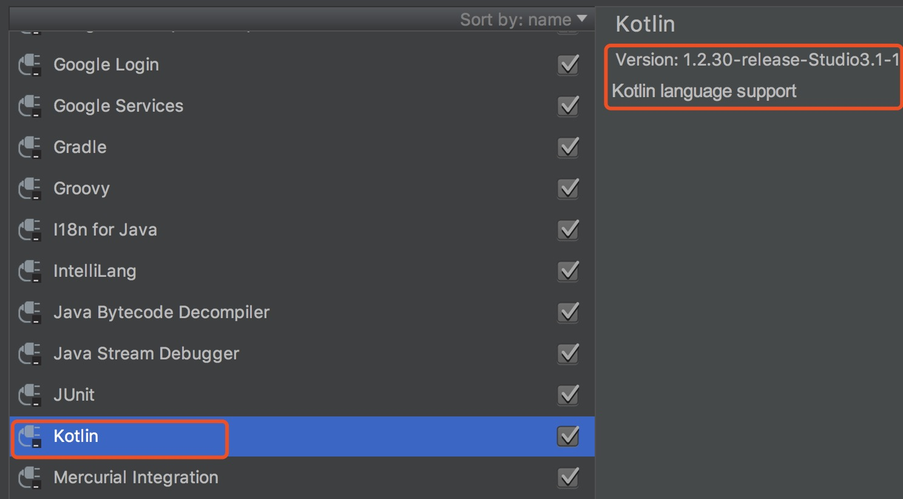
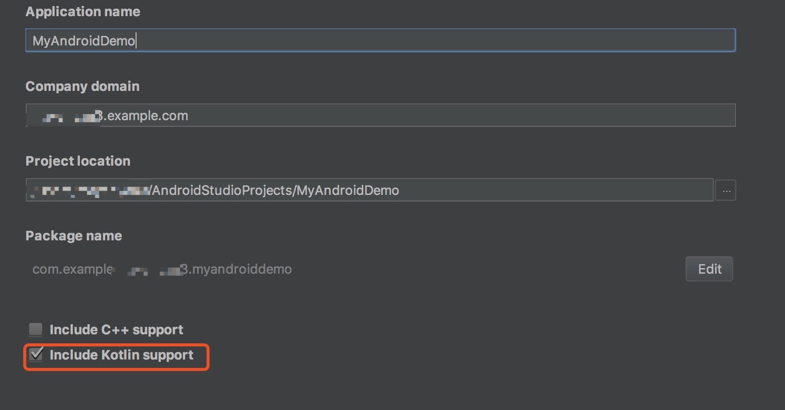
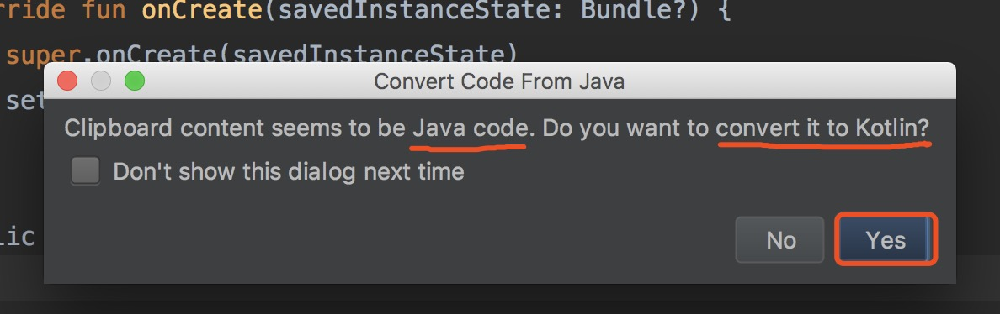
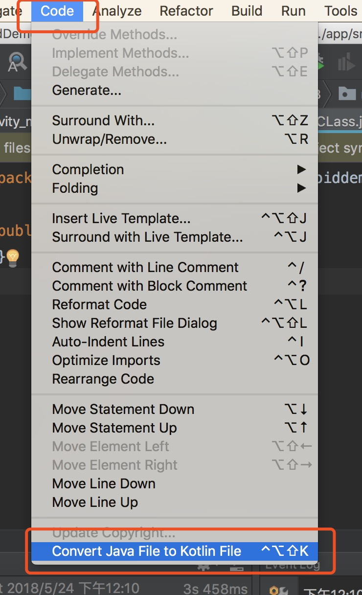
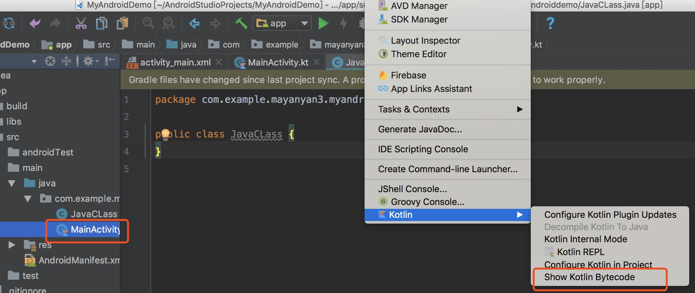
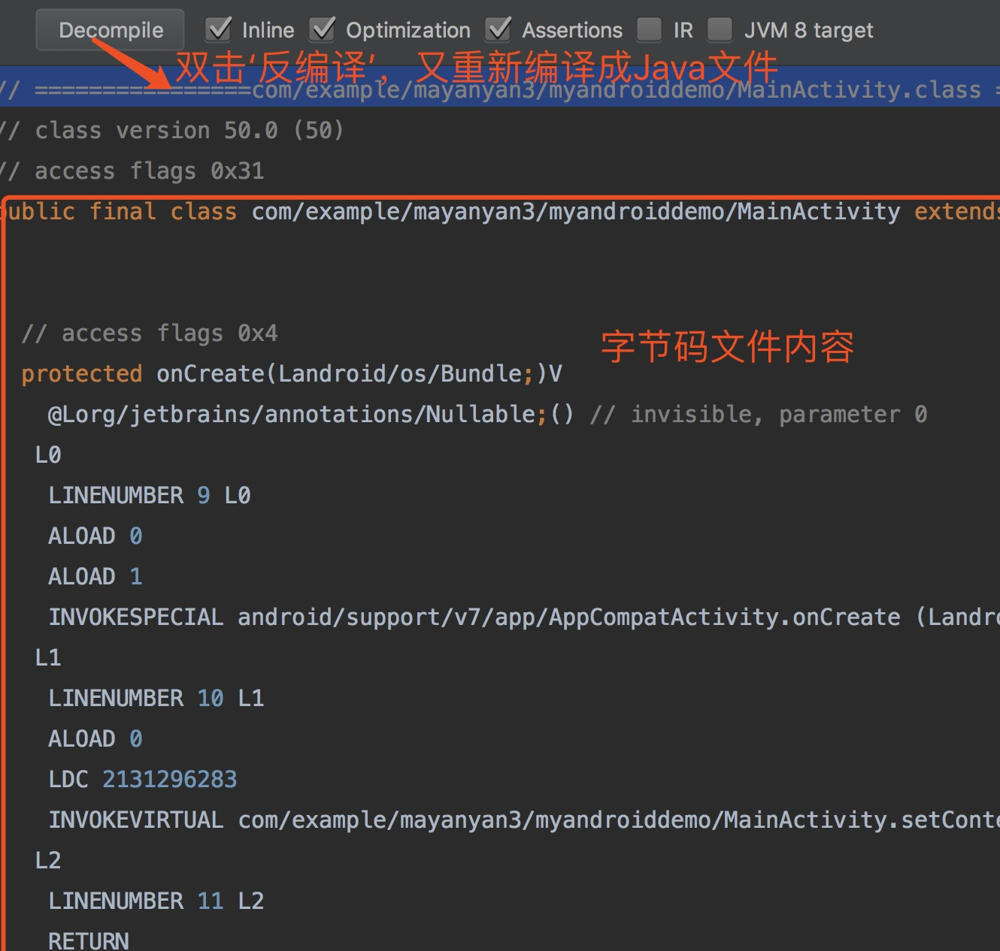
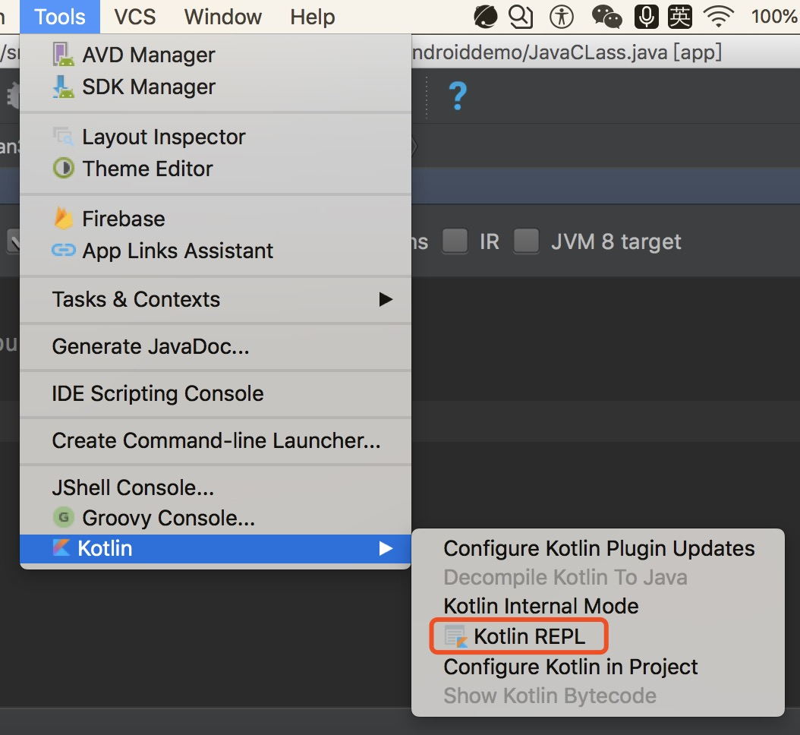
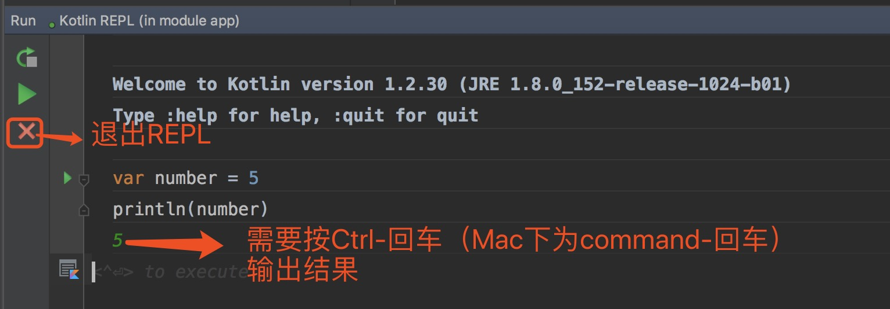

# Kotlin快速使用

## 准备工作
帮助你搭建开发环境，为编码做准备

### Android Studio
安装Android Studio，这是Android官方的IDE。Android Studio是Intellij IDEA的插件实现，Intellij IDEA是有JetBrains开发的，Kotlin就是JetBrains。所以为了更为简单的Kotlin开发环境的搭建，这里强烈建议使用 **Android Studio 3.0及以上版本**。

### 安装Kotlin插件
因为从Intellij 15开始，插件是默认安装的，但是低于Android Studio 3.0 并没有，所以需要进入Android Studio的plugin，安装Kotlin插件。这里还是介绍下Kotlin插件安装方法：**Android->setting->选择‘plugins’->Browse repositories->搜索'kotlin'->点击“install”，然后重启Android Studio即可**。

kotlin插件安装成功的标志：如下




现在环境已经可以理解Kotlin语言了，就像我们使用Java一样无缝地编译执行Kotlin

## 创建一个新的项目
首先打开Android Studio，点击'新建项目'然后按照要求输入项目名称,选中‘include Kotlin support’，如下图所示：



之后一直点击‘Next’，知道’finish’完成继续创建项目

## 配置Gradle

Kotlin插件包括一个让我们配置的额Gradle的工具。按照上面所述方法新建Kotlin项目后build.gradle会默认帮我们配置好，这里，我们进行熟悉下

```Groovy
buildscript {
    ext.kotlin_version = '1.2.30'
    ext.anko_version = '0.10.1'
    repositories {
        google()
        jcenter()
    }
    dependencies {
        classpath 'com.android.tools.build:gradle:3.1.2'
        classpath "org.jetbrains.kotlin:kotlin-gradle-plugin:$kotlin_version" //Kotlin插件的dependency
    }
}

allprojects {
    repositories {
        google()
        jcenter()
    }
}
```

如你看到的一样，这里使用ext创建一个变量来存储Kotlin版本，第二个参数是用来存储Anko版本，用这种方式可以方便的控制Kotlin和Anko版本。

Anko是一个用来简化一些Android任务的很强大的Kotlin库，我们之后将会介绍Anko

## Java to Kotlin converter
Kotlin plugin包含了一些有趣的特性，他能把Java代码转码成Kotlin代码。即将现有的Java项目迁移到Kotlin项目，因为很可能我们在同一个项目中同时使用Java和Kotlin，便可以通过这种特性进行转换

+ 第一种方法：

将Java代码拷贝，复制到剪切板，然后粘贴到Kotlin文件中，系统会提示如下：



点击“Yes”即可

+ 第二种方法：

选中Java文件，点击Android Studio上code按钮，选择'Converter java File to Kotlin File'，如下图所示：



<font color = red>第一种方法是基于第二种方法的，强烈建议使用第二种方法</font>


## Kotlin Android Extensions

让开发更加简单的插件是Kotlin Android Extensions。当前仅仅包括了view的绑定，这个插件让我们直接访问XML中的View。这些 **属性的名字** 就是对应于 **view的id** 所以我们命名id时要小心，因为它将会是我们类中非常重要的一部分。

Kotlin Android Extensions 的一个优点是它不需要我们在代码中依赖其他额外的库。仅仅由插件组成，需要时用于生成工作所需的代码，只需要依赖于Kotlin的标准库


### Kotlin Android Extensions使用

我们在创建项目是，就已经在build.gradle中增加了这个依赖

```groovy
buldscript{
  repositories {
    jcenter()
  }
  dependencies {
    classpath "org.jetbrains.kotlin:kotlin-android-extension
    s:$kotlin_version"
  }
}
```

在我们使用view时，直接使用xml中id的名字，会自动导入引用，import语句以 **kotlin.android.synthetic** 开头，然后加上我们需要绑定到Activity的布局 **xml名字** ,例如：

### Activity的Android Extensions

```kotlin
import kotlin.android.synthetic.activity_main.*
```

此后，就可以在setContentView被调用后访问这些view


### Views的Android Extensions

一个view或者一个adapter唯一与Activity不同就是import语句，需要做的就是手动添加依赖 **import** 来使用它

```kotlin
import kotlinx.android.synthetic.view_item.view.*
```

## 测试是否一切就绪

在编写Hello Word程序，并运行。

+ 打开activity_main.xml,设置一个TextView的id

```xml
<TextView
    android:id="@+id/message"
    android:text="@string/hello_world"
    android:layout_width="wrap_content"
    android:layout_height="wrap_content"/>
```

+ Activity的onCreate()，访问这个TextView

```kotlin
override fun onCreate(savedInstanceState: Bundle?) {
    super.onCreate(savedInstanceState)
    setContentView(R.layout.activity_main)
    message.text = "Hello Kotlin!" //由于Kotlin Android Extensions这个功能，这里不用再使用findViewbyId
}

```

+ manifest.xml文件中声明MainActivity作为入口类，链接模拟器，点击run，便完成了一个简单的‘Hello Word’
App创建运行


## Show Kotlin ByteCode（Kotlin字节码文件）

进行开发Android App的开发人员，都知道字节码文件，那么就会产生，Kotlin文件的字节码文件是什么样的呢？跟Java文件是相同的么？

下面介绍使用Android Studio功能如何查看字节码文件：



然后便弹出”Kotlin Bytecode” 可以查看字节码文件，具体界面如下：



##运行Kotlin代码的另一种方式

Android Studio提供了一种替代方法运行Kotlin代码，而不需要运行Android应用程序。当你需要快速的测试一些Kotlin代码是，这是非常有用的，这与Android的长期编译和部署是分开的。

这种方法就是使用 **REPL(Read Eval Print Loop)** ,REPL是一种简单的shell语言，它读取单个用户输入，计算并打印结果
。REPL看起来像命令行，但它将为我们提供所需的全部代码提示和将给我们访问各种项目中定义的结构。

运行界面如下所示：




